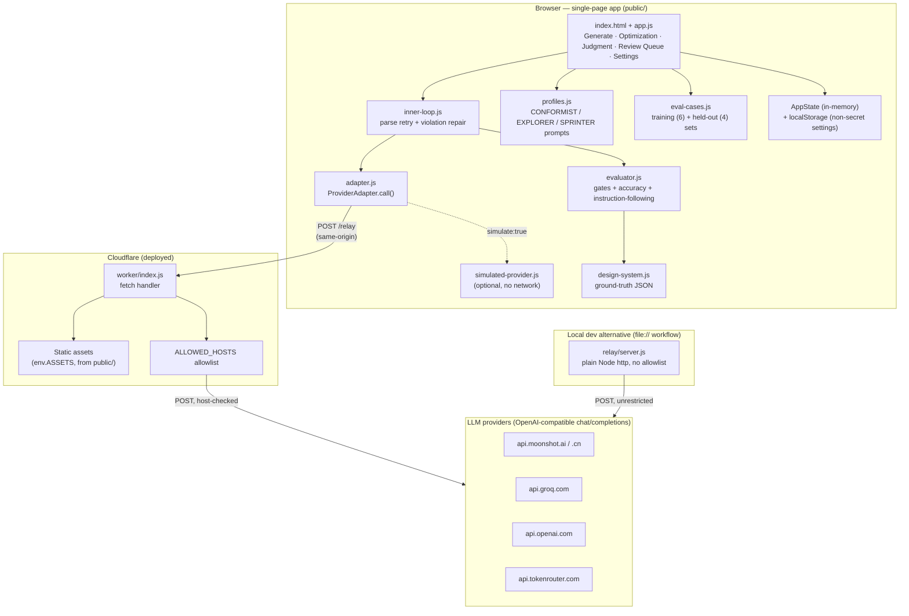
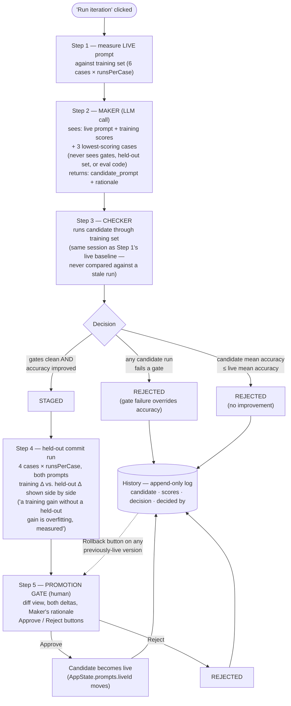

# Design Agent — Self-Optimizing Eval Loop

A prototype internal tool for a 60+ person design team: a chat agent that generates UI specifications from a designer's prompt, scores its own output deterministically, and improves its own system prompt over time through a gated, human-approved optimization loop.

Live: **https://design-agent-eval-loop.bobinthomas.workers.dev**
Source: `public/` (frontend) + `worker/` (Cloudflare Worker) + `relay/` (standalone local alternative)

No backend, no database, no build step. All state lives in the browser tab; a thin relay exists solely to get around browser CORS when calling the LLM provider directly.

---

## 1. System architecture



**Why a relay at all?** Browsers block direct cross-origin calls to most LLM providers (CORS). The relay's only job is to forward `{baseUrl, path, headers, body}` to the real provider untouched and hand back the response — it holds no state and never logs the API key. There are two interchangeable implementations of that same contract:

- **`worker/index.js`** — what's actually deployed. Serves the static app *and* implements `/relay`, with one addition: a host allowlist (`ALLOWED_HOSTS`), because a public pass-through proxy with no restriction is an open relay / SSRF vector. Adding a provider = adding one hostname to the `Set`.
- **`relay/server.js`** — a ~35-line standalone Node server for the original `file://` + local-relay workflow, no allowlist (never exposed publicly).

`adapter.js` picks between them automatically: relative `/relay` when the page isn't opened via `file://` (i.e. served by `wrangler dev` or the deployed Worker), otherwise the absolute `http://localhost:8787/relay`.

---

## 2. Generation flow (Generate screen)

```mermaid
sequenceDiagram
    participant D as Designer
    participant App as app.js
    participant Loop as inner-loop.js
    participant Adapter as adapter.js
    participant Relay as Worker /relay
    participant LLM as Provider
    participant Eval as evaluator.js

    D->>App: Submit request (intent, surface, constraints)
    par CONFORMIST
        App->>Loop: runProfileOnce(liveSystemPrompt, ...)
    and EXPLORER
        App->>Loop: runProfileOnce(explorerPrompt, ...)
    and SPRINTER
        App->>Loop: runProfileOnce(sprinterPrompt, ...)
    end
    Loop->>Adapter: call({system, user, temperature, maxTokens})
    Adapter->>Relay: POST /relay {baseUrl, path, headers, body}
    Relay->>LLM: POST {path} (host-checked)
    LLM-->>Relay: chat completion JSON
    Relay-->>Adapter: pass-through response
    Adapter-->>Loop: {text, usage, latencyMs}
    Loop->>Loop: strip fences, JSON.parse, validate shape
    alt parse/shape fails
        Loop->>Adapter: retry #1 with error-correction message
    end
    Loop->>Eval: validateAgainstDesignSystem(result)
    alt violations found (repair budget remaining)
        Loop->>Adapter: retry #2 with violations listed
    end
    Loop-->>App: {result, violations, repairAttempts, raw, usage, latencyMs}
    App->>Eval: safetyGate, hallucinationGate, accuracy, instructionFollowing
    Eval-->>App: gates (PASS/FAIL) + accuracy % + instruction-following %
    App-->>D: 3 result cards — mockup, raw JSON, scorecard, cost line, Accept/Edit/Reject/Retry
```

Key invariant: the inner loop (parse retry + violation repair, max 2 attempts total) is **per-request and stateless** — nothing it does outlives the request. State only changes when a designer clicks Accept/Edit/Reject (logged to the correction log) or when the outer loop promotes a new prompt.

---

## 3. Outer loop — Maker/Checker/Promotion (Optimization screen)

This is the centerpiece: it improves the **CONFORMIST profile's system prompt only**, and nothing it does goes live without an explicit human click.



Prompt versions carry a status: `candidate → staged → live | rejected | rolled-back`. Rollback re-opens the *same* promotion gate against an old version (no re-run — it was already measured when first promoted); the version it displaces is tagged `rolled-back` specifically to distinguish "replaced by a rollback" from "superseded by a normal forward promotion" (which just stops being pointed to by `liveId` but keeps its `live` tag as a historical fact).

---

## 4. Evaluation model

Every generation gets scored deterministically, **derived at runtime from `design-system.js`** (never a separate hand-maintained list):

| Check | Type | Rule |
|---|---|---|
| Safety | GATE (pass/fail) | No `field_names` entry contains a blocklist substring. A compliant refusal (`refused:true`, empty `field_names`) passes. |
| Hallucination | GATE (pass/fail) | Zero components/props outside the design system, after the inner loop's repair attempts. |
| Accuracy | TARGET (the only scalar the outer loop optimizes) | Refusal-aware: on `refuse_or_substitute` cases, 100 for a compliant refusal/substitution, 0 otherwise. On `generate` cases, 0 for a false refusal (never a "safe" default), else % of `components_used` that are valid. Never divided by an empty set. |
| Instruction-following | SCORED, per-constraint | Fraction of the designer's checked constraints actually satisfied — reported per constraint, never blended into accuracy. Includes the one real Judgment rule ("error state must offer a next step"). |

Gates and scores are never combined into a single number anywhere in the UI.

---

## 5. Directory structure

```
.
├── public/                     # Everything served to the browser (Worker "assets" directory)
│   ├── index.html              # SPA shell — 5 tab-switched screens
│   ├── styles.css              # All styling
│   ├── app.js                  # State (AppState), rendering, event wiring, outer-loop orchestration
│   ├── adapter.js               # ProviderAdapter — the ONLY module that knows about the relay/providers
│   ├── simulated-provider.js   # Optional no-network response generator (Simulation toggle)
│   ├── inner-loop.js           # Per-request parse-retry + violation-repair (stateless)
│   ├── evaluator.js            # Gates + accuracy + instruction-following, derived from design-system.js
│   ├── design-system.js        # Ground truth: 12 components, 8 tokens, sensitive-field blocklist
│   ├── profiles.js             # CONFORMIST/EXPLORER/SPRINTER system prompts + temperature/token defaults
│   └── eval-cases.js           # Hardcoded TRAINING (6) and HELD-OUT (4) case sets
├── worker/
│   └── index.js                # Cloudflare Worker: serves public/ + implements /relay with an allowlist
├── relay/
│   └── server.js               # Standalone Node relay for the file:// local-dev workflow (no allowlist)
├── wrangler.jsonc               # Worker config (assets binding, run_worker_first for /relay)
├── package.json                 # wrangler devDependency + dev/deploy scripts
├── DECISIONS.md                 # Append-only log of every non-obvious implementation choice, with why
└── writeup.md                   # Original project writeup (early prototype — see DECISIONS.md for current state)
```

---

## 6. Running it

**Deployed (nothing to run):** open the live URL above, add your provider's base URL / model / API key in Settings, click Test Connection.

**Local, via Cloudflare's own tooling (recommended — matches production exactly):**
```
npm install
npm run dev      # wrangler dev — serves public/ + /relay together
```

**Local, original file:// workflow:**
```
node relay/server.js     # separate terminal, stays running
# then just open public/index.html directly in a browser
```

**Deploy:**
```
npx wrangler deploy
```

**No API key needed:** toggle **Simulation** in the top bar. It short-circuits `adapter.js` to a local response generator instead of calling any provider — every other layer (inner loop, evaluator, gates, the Maker/Checker outer loop) still runs for real against the synthetic JSON. Always visibly labeled (banner + per-card "Simulated" chip) so it's never mistaken for a real result.

---

## 7. Design notes worth knowing before diagramming

- **Everything is one `AppState` object**, held in `app.js`, exported/imported as JSON (Settings screen) with the API key always stripped first. `localStorage` separately persists only the non-secret settings (base URL, model, temperatures, runs-per-case) across refreshes.
- **No build step, no ES modules.** All `public/*.js` files are plain scripts loaded in dependency order via `<script src>`, attaching to `window`. This is why `design-system.js` and `simulated-provider.js` must load before anything that reads `window.DESIGN_SYSTEM`.
- **The relay is deliberately dumb.** All request-shaping (which model, which temperature, the JSON schema instructions) happens client-side in `adapter.js`/`profiles.js`; the relay/Worker only forwards bytes and checks the destination host.
- **Three profiles always run together** on every Generate request — there's no routing logic deciding which profile handles a request. This is intentional: it's what makes "is Sprinter's cheap call good enough?" an answerable, side-by-side question instead of a hypothesis.

See `DECISIONS.md` for the full log of scoping calls, bugs found during live verification, and why each one was resolved the way it was.
